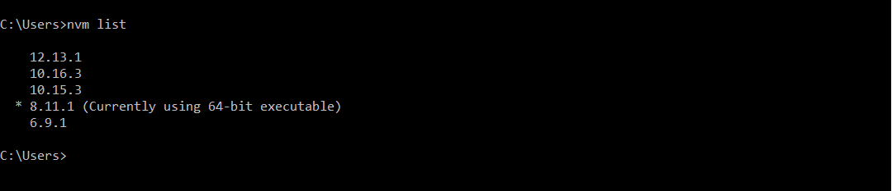

While working on the multiple projects of NodeJs, we you might required to run different projects on the different node js version or for the legacy node js projects you might required old version of the nodejs version ,and the others required new version of node js, or to checkout the new feature of nodejs, you need to installed latest version of node js 

As on the same machine we can only install one version of the nodejs, so its very painful to uninstall and install new node version as per your project required.

To overcome this problem, we can use the Node Version Manager (NVM). NVM allow to install multiple node js version on the same machine and we can switch between the required node js version.


# Installation
## Window

Download the latest version of NVM

https://github.com/coreybutler/nvm-windows/releases/latest

Download nvm-setup.zip and install on the window

### Verify Installation
```
nvm version
```

## MacOs/Linux

Using curl
```
curl -o- https://raw.githubusercontent.com/nvm-sh/nvm/v0.38.0/install.sh | bash
```
Using Wget
```
wget -qO- https://raw.githubusercontent.com/nvm-sh/nvm/v0.38.0/install.sh | bash
```
### Verify Installation
```
command -v nvm
```

# Usage

##  Get List of all available node js versions
```
nvm  ls available //window

nvm ls-remote //MacOs/Linux
```

## Install the multiple NodeJs version
### Install latest node js version
```
nvm install node
```
### Install latest LTS Release 
```
nvm install --lts
```
### Install particular node js version
Multiple node js version can be installed using below command
```
nvm install 8.11.1 // to install the 8.11.1 version

nvm install 12.13.1 //to install the 12.13.1 version
```
## UnInstall the multiple NodeJs version
```
nvm uninstall 8.11.1
```

## Switching the NodeJs version
### Get List of installed node js version
```
nvm list  //for window

nvm ls //for MacOs/linux
```


### Switching Between installed NodeJs Versions
```
nvm use 8.11.1  //To enable 8.11.1

nvm use 12.13.1 //To enable 12.13.1

```


